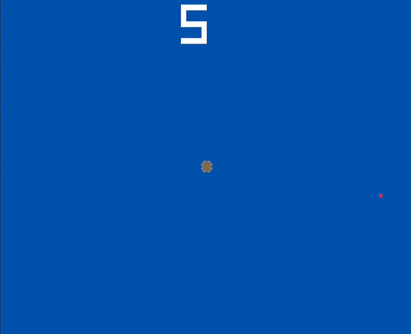
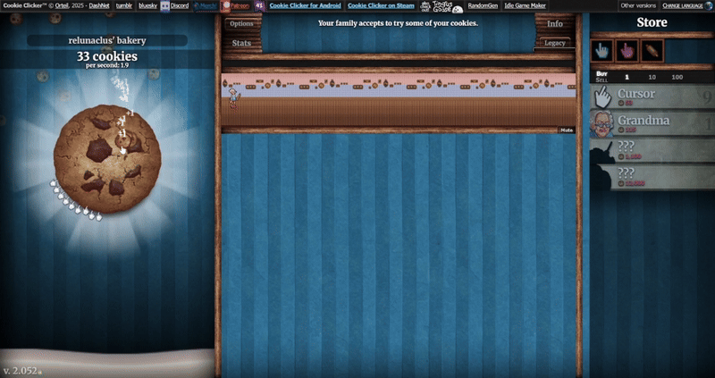
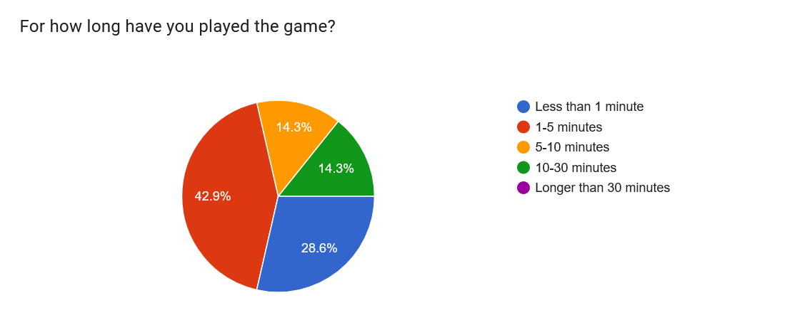
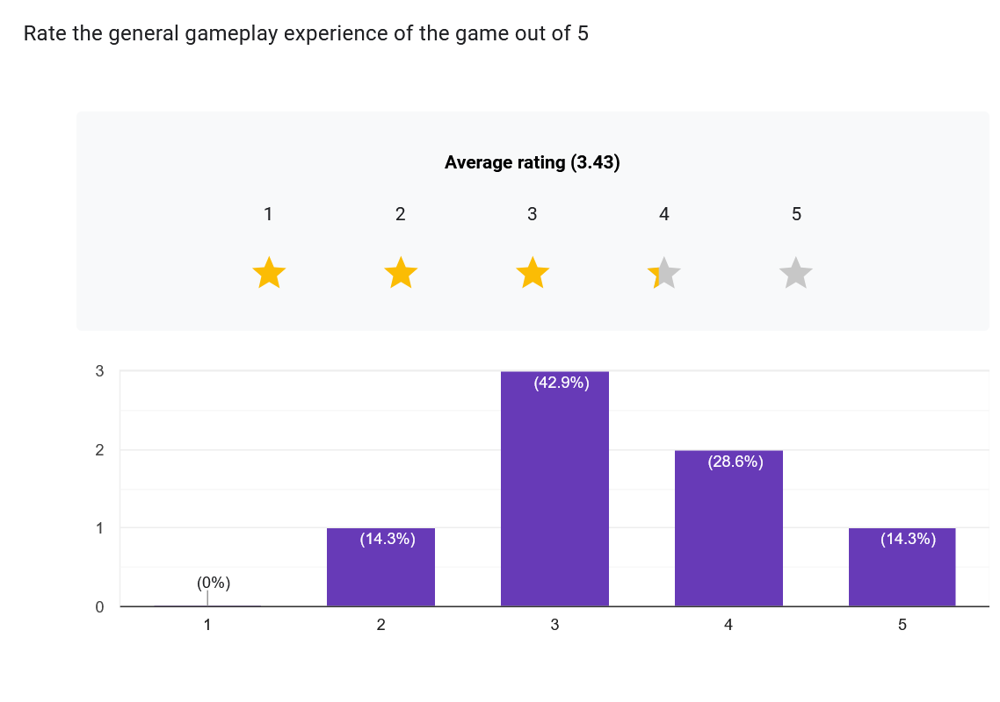
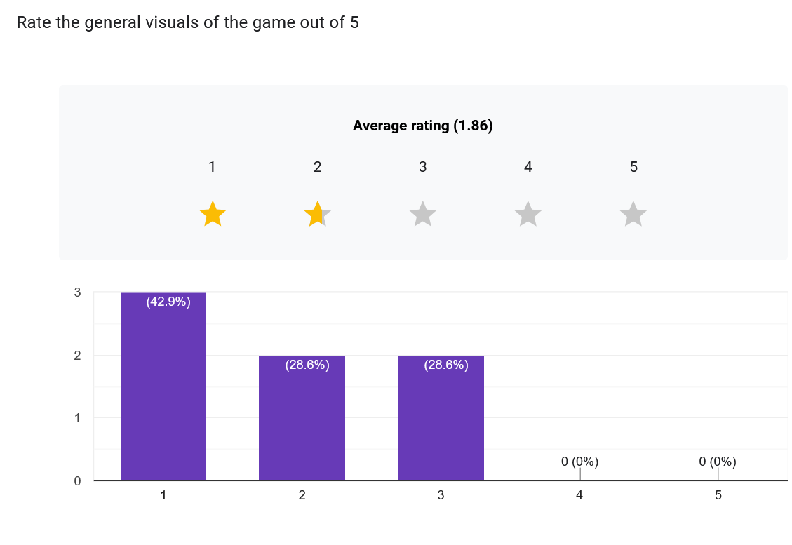
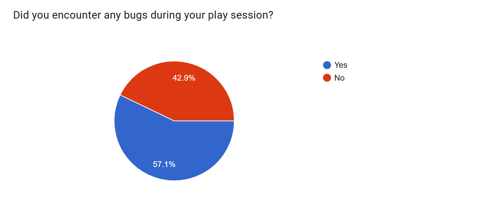

# FGCT4015 - Fundamentals of Game Development
## Coin Collector
Student Name: Benjamin Sibley  
Date: 05/12/2025

[Repository Link](https://github.com/relunaclus/Coin-Collector)   
[Build Link](https://relunaclus.itch.io/coin-collector)

### Project Outline

Coin Collector is a simple top down 2D idle style game with simplistic graphics that takes inspiration from many .io style games and other idle games, most notably "Agar.io."
It fits the theme "pocket" as the player controls a coin with the goal of collecting more coins, inspired by the concept of losing change in a pocket. As the player collects coins, new coins will spawn and the player will increase in size. Additionally, the score above the player will increase, this score can be used in order to buy upgrades which let the player increase point generation even further.


Figure 1: A gif of Coin Collector being played

### Research

#### Methodology

Upon learning the project's theme was pocket I very quickly decided to create a game themed around loose change in a pocket. My initial idea is to create a game where the player controls a coin with a certain amount of money, and has the goal to collect more coins to increase both their value and size while avoiding other obstacles typical to the environment of a pocket such as lint or paper which would damage the player causing them to lose value. As the player gains more points, the player's size increases and it becomes more difficult to avoid obstacles.

I began by taking influence from another game where the player gains size as they gain score, being Agar.io (Agar.io, s.d.), a simple but popular multiplayer game where each player controls a cell in search of resources to increase in size.   


Figure 2: A gif of Agar.io being played

The obstacles and challenges in Agar.io mostly come from other players, who, if their cell is larger than yours, can eat it and grow much faster than eating the non-player resources. In addition, you can press the W key in order to split your cell into two different cells, propelling one forward. This can be used tactically as a quick escape from danger at the cost of lowering your effectiveness by decreasing your size.

A more complex example of the same general gameplay idea is from SPORE (SPORE™ on Steam, s.d.), a game from 2008 with 5 stages, but the stage I have focused on is the cell stage, which has similar basic cell gameplay to Agar.io with increased complexity as different parts can be added to your cell to modify its effectivity in various ways such as increasing speed, changing the types of food that can be eaten, or adding self-defensive features such as spikes or poison to increase the chance of survival.  

  
Figure 3: A gif of Spore in its cell stage being played

Another game that I took inspiration from was Cookie Clicker (Cookie Clicker, s.d.), a popular game playable both on browser and on steam. Cookie Clicker is a game with a simple gameplay loop where the player generates cookies by clicking before using those cookies to buy upgrades that increase the amount of cookies they generate, either by generating independent passive cookies over time, or by increasing cookies generated by actively clicking. This inspired me to implement a similar upgrade system into my game.


Figure 4: A gif of Cookie Clicker being played

#### Game Sources
Agar.io (s.d.) At: https://agar.io/ (Accessed  02/12/2025).  
SPORE™ on Steam (s.d.) At: https://store.steampowered.com/app/17390/SPORE/ (Accessed  02/12/2025).  
Cookie Clicker (s.d.) At: https://orteil.dashnet.org/cookieclicker/ (Accessed  02/12/2025).  

#### Academic Sources
McGrath, M. C++ programming in easy steps (Accessed 25/11/2025).  

#### Documentation Sources
raylib - cheatsheet (s.d.) At: https://www.raylib.com (Accessed  09/10/2025).  
Header Files in C++ (12:22:26+00:00) At: https://www.geeksforgeeks.org/cpp/header-files-in-c-c-with-examples/ (Accessed  06/10/2025).  
Switch Statement in C++ (12:09:50+00:00) At: https://www.geeksforgeeks.org/cpp/switch-statement-in-cpp/ (Accessed  06/10/2025).  

### Implementation

#### Process

This project was my first time using any sort of programming language at all, because of this, a lot of my earlier focuses was on creating systems that worked primarily and during the creation process I learned as I went creating more optimised systems. For example, to begin with a lot of player stats simply existed as variables lying towards the top of my main.cpp file and later in development were moved into a header file and the player became a struct.

``` cpp 
struct Player {
    int x = 400;
    int y = 300;
    int speedX = 3;
    int speedY = 3;
    int points = 5;
    float rad = points + 5;
    int mag = 0;
    int gro = 1;
    float effectiveRad = rad + mag;
    int range = rad/2;
    Color color = BROWN;
};
```

Additionally, earlier in development, handling in player colour changes when reaching certain milestones in points was handled by manually inputting a colour for each milestone, which was later changed to be handled by an array
``` cpp
    Color playercolors[4] = {BROWN, ORANGE, LIGHTGRAY, GOLD};
```
``` cpp
    // changing player colour based on points
    if(player.points <= 10){
    player.color = playercolors[0];
    }
    else if(player.points <= 20){
    player.color = playercolors[1];
    }
    else if(player.points<= 30){
    player.color = playercolors[2];
    }
    else{
     player.color = playercolors[3];
    }
```
I additionally implemented switch statements when concluding it would be useful for distinguishing the separate gamestates between the game and the shop. The gamestates are controlled by an enum

``` cpp
    enum GameState{
        Game,
        Shop 
    };

    GameState state = GameState::Game;
```
``` cpp
    switch (state){
    case GameState::Game:
    
        // player movement
        if(IsKeyDown(KEY_W) && player.y > 0){
            player.y -= player.speedY;
        }
        if (IsKeyDown(KEY_S) && player.y < SCREEN_HEIGHT){
            player.y += player.speedY;
        }
        if (IsKeyDown(KEY_A) && player.x > 0){
            player.x -= player.speedX;
        }
        if(IsKeyDown(KEY_D) && player.x < SCREEN_WIDTH){
            player.x += player.speedX;
        }
```
Here player movement is handled using a fairly simple system that also allows for the player to move diagonal, allowing for 8 directional movement overall. A simple measure is also used to prevent the player from escaping the confines of the play space.

``` cpp
        // collision
        if(CheckCollisionCircles({player.x, player.y}, player.effectiveRad, {coin.x, coin.y}, coin.rad)){
            coin.x = GetRandomValue(0, SCREEN_WIDTH);
            coin.y = GetRandomValue(0, SCREEN_HEIGHT);
            player.points += player.gro;
            coin.rad += player.gro;
            player.rad = player.points + 5;
            player.effectiveRad = player.rad + player.mag;
            SetSoundVolume(getCoin, 1);
            PlaySound(getCoin);
```

This handles the player's collision with the coins that they will collect to increase points, it uses an if statement that detects if a collision between the player and the coin occurs, if it does the player's points will increase by its growth rate and the coin will choose a new place within the play area to teleport to. A sound effect is also played.

``` cpp
            // makes coins not spawn too close to the player
            if(CheckCollisionCircles({player.x, player.y}, player.effectiveRad+player.range, {coin.x, coin.y}, coin.rad)){
                coin.x = GetRandomValue(0, SCREEN_WIDTH);
                coin.y = GetRandomValue(0, SCREEN_HEIGHT);
            }
        }
```
This makes sure that the coin will reposition if it spawns too close to the player.

``` cpp
        if(IsKeyPressed(KEY_E)){
            state = GameState::Shop;
        }
        break;
```
When E is pressed, the game state changes to shop.

``` cpp
    case GameState::Shop:

    if(player.points >= (mag.price +1)){
        mag.color = RAYWHITE;
    }
    else{
        mag.color = GRAY;
        }
```
If the player can afford an upgrade the texture is in full colour, otherwise it is greyed out. This is repeated for both other upgrades.

```cpp
        if(IsKeyPressed(KEY_ONE) && player.points >= (mag.price + 1)){
            player.mag += 10;
            player.points -= mag.price;
            mag.inflation += 1;
            mag.price = mag.bPrice * mag.inflation;
            player.rad = player.points + 5;
            player.effectiveRad = player.rad + player.mag;
            if(player.rad >= 5){
                coin.rad = player.rad -2;
            }
            else{
                coin.rad = 3;
            }
            PlaySound(getUpgrade);
        }
```
If the player can afford an upgrade and presses the respective key to buy it, it will buy the upgrade and handle its effects, before playing a sound effect.

``` cpp
        if(IsKeyPressed(KEY_R)){
            state = GameState::Game;
        }
```
The player can return to the game state by pressing R while in the shop.

``` cpp
    if (!hasGameStarted) {
                    json data = JSON::loadData();

                    player.points = data["Score"];
                    hasGameStarted = true;
                }
```

I used an external library, (Lohmann, 2025) to create the data saving system, I was also helped by one of my peers during this. The code will also create a new savefile if it cant find an old one.

#### New Approaches

This project was my first real introduction to any sort of programming language, and as a result my game's creation was largely a learning experience for its whole development. Initially my code was relatively unorganised and lacked a lot of readability, such as including magic numbers and strange formatting, but slowly I have noticed improvement. This also means this was my first introduction to raylib. Additionally this was my first time using Github which I fortunately managed to adjust to fairly smoothly. Overall this has been a wholely new experience to me but I believe that over the course of these past 10 weeks I have handled in well and developed my skills.  

My IDE, Visual Studio Code is interestingly, the only aspect of the project that I have used before due to previous use of the Skript plugin for Minecraft, which is a plugin allowing users to use a scripting language to execute functions and commands in Minecraft.

### User Testing

#### Early Build User Testing  

During the game creation process, I conducted guiding testing with multiple of my peers in order to gather data to understand how to improve the game and identify any bugs that may crop up, all data used was done so with the consent of all who answered it that it would be used to improve the game.    


Figure 5: A bar graph showing responses to rating the game on a 5 star scale

This graph shows that overall reception to the gameplay in earlier builds was positive, when asked for more info, testers stated that the overall, basic gameplay loop was fun and addicting, some criticisms were raised at the lack of tutorialisation and instruction for how to play the game.  


Figure 6: A bar graph showing responses to rating the game's graphics on a 5 star scale

Overall receptions to the graphical components of the game in this earlier build were less positive, with most people rating towards the center, 2-3 stars. Some playtesters concluded that the very simple graphics coming from raylib's basic shape functions were too simple, while others liked the basic aesthetic created from this.


Figure 7: A pie chart showing showing the percentages of players who encountered a bug and who didn't, showing that half of all players encountered a bug.   

Half of the testers surveyed stated that they encountered a bug, a notable bug present in this early build was that due to the player's score directly affecting their size, the game would be rendered unplayable if the player had exactly the amount of points required to buy an upgrade, as the players size would be set to 0 making them not rendered in the scene and unable to collect any additional coins to increase their score. This bug was later fixed by altering how the score effected size and implementing a minimum size.

#### Release Build User Testing

At the game's release I seeked feedback from players of the game by including a link on my itch.io page, and received some responses. This data again was processed with consent by those who answered the form.


Figure 8: A bar graph showing how long each player played the game for.

In this instance I asked the playerbase for how long they spent playing the game. most players played for a fairly short amount of time, less than 5 minutes. This data can be used to understand for how long each player played and compare it to their experiences and opinions surrounding the game.


Figure 9: A bar graph showing the opinion spread on the general gameplay of the game.

I once again asked players to rate gameplay on a 5 star scale, the average rating lies at around 3.4 stars which suggests that the gameplay has a solid foundation but has room for improvement. When asked for more info, players overall said that the basic gameplay was fun but perhaps too simplistic, and can get boring after playing for a while due to the lack of threats present in the game. The player has no way of losing points besides spending them on upgrades, which benefit them. Another issue with this was pointed out when asked if any bugs were encountered, where multiple players reported the same issue that at a certain point the player is too big and the game becomes effectively unplayable.


Figure 10: A bar graph showing the opinion spread on the general aesthetics of the game.  

The overall opinions on the graphics of the game were generally lower than the opinion on the gameplay, with an average rating of 1.86 stars, criticisms were that the graphics were extremely simplistic and basic, and that most of the graphics simply used raylib drawn circles or rectangles. Players overall wanted more visuals present instead of the basic raylib shapes besides the sprites present in the shops.


Figure 11: A pie chart showing the percentage of players who encountered bugs during their play sessions.

The majority of players encountered at least one bug, the most common bug reported was the aforementioned bug where the player can get so big that the player will instantly get the coin no matter what which results in infinite growth, rendering the game unplayable. Some players also noticed that moving diagonally was noticably faster than moving horizontally or vertically, this was due to an oversight where I did not normalise vectors.

### Outcome


#### Instructions to Run

**[itch.io](https://relunaclus.itch.io/coin-collector)**  
Download the the zip file from itch.io, unzip it, then run the exe file.  

**Source Code**  
To compile yourself, open the main.code-workspace, open the main.cpp, and then press F5.
### Reflection

#### Research Effectiveness

Overall I would say that the research that I have done while creating my game, both academically, and through playing similar games, has been immensely useful throughout the process of developing a fairly simple idle-style game taking inspiration from agar.io

#### Positive Analysis

Some good aspects of the game is that the basic gameplay loop, moving a circle to other circles to increase a number that can be spent of upgrades increasing the efficiency in which you increase that number, is fun and addictive, and the systems behind that work well. In addition the sound effects in the game generally act to highlight when the player is doing well and signify that, which adds a loose sort of reward to the player. The benefits to me as a person is that as my first project this has greatly assisted in improving my personal skill in a variety of different areas related to programming and Game Development.

#### Negative Analysis

Some flaws of the game are that there are still a number of bugs and oversights present in the release version, most notably the lack of normalised vectors allowing the player to move quicker diagonally and the player growing too large, which leads only to exponential growth that the game cannot accomodate for, making it effectively unplayable. The game also suffers from a lack of threats to the player which can make it boring after some time.

#### Next Time

Throughout the development of Coin Collector, I have learned a vast array about programming, games development, and raylib as a framework. As I was essentially starting from 0, everything done here was completely new to me, and I coult really tell my skills were developing throughout the project's creation. In the future if I continue to use raylib, I would like to do more with header files and functional programming. Something I regret about the project is having a very small scale and small scope. Though I chose to have a small scale due to my inexperience with the tools used, I believe that with my current understanding I could realistically increase the scale.

### References

Lohmann, N. (2025) JSON for Modern C++. At: https://github.com/nlohmann (Accessed  02/12/2025).  
Header Files in C++ (12:22:26+00:00) At: https://www.geeksforgeeks.org/cpp/header-files-in-c-c-with-examples/ (Accessed  06/10/2025).  
Switch Statement in C++ (12:09:50+00:00) At: https://www.geeksforgeeks.org/cpp/switch-statement-in-cpp/ (Accessed  06/10/2025).  
raylib - cheatsheet (s.d.) At: https://www.raylib.com (Accessed  02/12/2025).  
Agar.io (s.d.) At: https://agar.io/ (Accessed  02/12/2025).  
Cookie Clicker (s.d.) At: https://orteil.dashnet.org/cookieclicker/ (Accessed  02/12/2025).  
McGrath, M. C++ programming in easy steps (Accessed 25/11/2025).  
SPORE™ on Steam (s.d.) At: https://store.steampowered.com/app/17390/SPORE/ (Accessed  02/12/2025).  

### Declared Assets

IDE: Visual Studio Code   
Framework: Raylib  
Version Control: Git / Github   
I used the following external library during the creation process:  
Lohmann, N. (2025) JSON for Modern C++. At: https://github.com/nlohmann (Accessed  02/12/2025).    
To begin the creation I used the following template which includes compiler settings and a code workspace:  
Koumaris, N. (2025) educ8s/Raylib-CPP-Starter-Template-for-VSCODE. At: https://github.com/educ8s/Raylib-CPP-Starter-Template-for-VSCODE (Accessed  01/10/2025).  
General Personal Assistance, especially related to debugging and saving data from:  
GingerNinjaProgramming (s.d.) At: https://github.com/GingerNinjaProgramming (Accessed  03/12/2025).  
I used the software LibreSprite for Visual Asset Creation   
 LibreSprite (s.d.) At: https://libresprite.github.io/#!/ (Accessed  28/11/2025).  
 I used the website jsfxr for Audio Asset Creation  
 jsfxr (s.d.) At: https://sfxr.me/ (Accessed  24/11/2025).